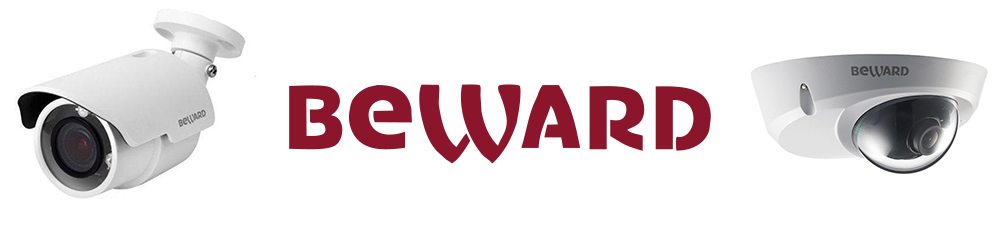

*Please :star: this repo if you find it useful*

# ha-beward

[](https://github.com/Limych/ha-beward/releases)
[](https://github.com/Limych/ha-beward/commits/master)
[](LICENSE.md)


[][hacs]


[](https://github.com/Limych/ha-beward/pulls)
[](https://github.com/Limych/ha-beward/issues?q=is%3Aopen+is%3Aissue+label%3ABug)

[][forum-support]

The `beward` implementation allows you to integrate your [Beward devices][beward] to Home Assistant.



There is currently support for the following device types within Home Assistant:
- [Binary Sensor](#binary-sensor)
- [Camera](#camera)
- [Sensor](#sensor)

Currently only doorbells are supported by this integration.

I also suggest you [visit the support topic][forum-support] on the community forum.

## Installation

Manual installation:

1. Using the tool of choice open the directory (folder) for your HA configuration (where you find `configuration.yaml`).
2. If you do not have a `custom_components` directory (folder) there, you need to create it.
3. In the `custom_components` directory (folder) create a new folder called `beward`.
4. Download _all_ the files from the `custom_components/beward/` directory (folder) in this repository.
5. Place the files you downloaded in the new directory (folder) you created.
6. Restart Home Assistant
7. Add `beward:` to your HA configuration.

Using your HA configuration directory (folder) as a starting point you should now also have this:

```text
custom_components/beward/__init__.py
custom_components/beward/binary_sensor.py
custom_components/beward/camera.py
custom_components/beward/const.py
custom_components/beward/helpers.py
custom_components/beward/manifest.json
custom_components/beward/sensor.py
```

<p align="center">* * *</p>
I put a lot of work into making this repo and component available and updated to inspire and help others! I will be glad to receive thanks from you — it will give me new strength and add enthusiasm:
<p align="center"><br>
<a href="https://www.patreon.com/join/limych?" target="_blank"></a>
<br>or&nbsp;support via Bitcoin or Etherium:<br>
<a href="https://sochain.com/a/mjz640g" target="_blank"><br>
16yfCfz9dZ8y8yuSwBFVfiAa3CNYdMh7Ts</a>
</p>

## Configuration

To enable Beward device, add the following to your `configuration.yaml` file:
```yaml
# Example configuration.yaml entry
beward:
  - host: HOST_ADDRESS_CAMERA
    username: YOUR_USERNAME
    password: YOUR_PASSWORD
```

### Configuration variables

**host**:\
  _(string) (Required)_\
  The IP address or hostname of your Beward device. If using a hostname, make sure the DNS works as expected.

**username**:\
  _(string) (Required)_\
  The username for accessing your Beward device.

**password**:\
  _(string) (Required)_\
  The password for accessing your Beward device.

**name**:\
  _(string) (Optional)_\
  This parameter allows you to override the name of your Beward device in the frontend.\
  _Default value: "Beward <device_id>"_

**port**:\
  _(integer) (Optional)_\
  The port that the Beward device is running on.\
  _Default value: 80_

**rtsp_port**:\
  _(integer) (Optional)_\
  The RTSP port that the Beward camera is running on.\
  _Default value: Autodetect from the device_

**stream**:\
  _(integer) (Optional)_\
  Number of video stream from Beward device.\
  _Default value: 0_

**ffmpeg_arguments**:\
  _(string) (Optional)_\
  Extra options to pass to ffmpeg, e.g., image quality or video filter options.\
  _Default value: "-pred 1"_

**Note:** To be able to playback the live stream, it is required to install the `ffmpeg` component. Make sure to follow the steps mentioned at [FFMPEG documentation][ffmpeg-doc].

**cameras**:\
  _(list) (Optional)_\
  Camera types to display in the frontend. The following cameras can be added:\
  _Default value: all cameras below_

> **live**:\
> Live view camera.
>
> **last_motion**:\
> Camera which store photo of last motion.
>
> **last_ding**:\
> Camera which store photo of last visitor.

**binary_sensors**:\
  _(list) (Optional)_\
  Conditions to display in the frontend. The following conditions can be monitored:\
  _Default value: None_

> **online**:\
> Return `on` when camera is available (i.e., responding to commands), `off` when not.
>
> **motion**:\
> Return `on` when a motion is detected, `off` when not.
>
> **ding**:\
> Return `on` when a doorbell button is pressed, `off` when not.

**sensors**:\
  _(list) (Optional)_\
  Conditions to display in the frontend. The following conditions can be monitored:\
  _Default value: None_

> **last_activity**:\
> Return the timestamp from the last event captured (ding/motion/on demand) by the Beward device camera.
>
> **last_motion**:\
> Return the timestamp from the last motion event captured by the Beward device camera.
>
> **last_ding**:\
> Return the timestamp from the last time the Beward doorbell button was pressed.

<p align="center">* * *</p>
I put a lot of work into making this repo and component available and updated to inspire and help others! I will be glad to receive thanks from you — it will give me new strength and add enthusiasm:
<p align="center"><br>
<a href="https://www.patreon.com/join/limych?" target="_blank"></a>
<br>or&nbsp;support via Bitcoin or Etherium:<br>
<a href="https://sochain.com/a/mjz640g" target="_blank"><br>
16yfCfz9dZ8y8yuSwBFVfiAa3CNYdMh7Ts</a>
</p>

## Advanced Configuration

You can also use this more advanced configuration example:

```yaml
# Example configuration.yaml entry
beward:
  - host: HOST_ADDRESS_CAMERA_1
    username: YOUR_USERNAME
    password: YOUR_PASSWORD
    binary_sensors:
      - motion
      - online
    sensors:
      - last_ding

  # Add second camera
  - host: HOST_ADDRESS_CAMERA_2
    username: YOUR_USERNAME
    password: YOUR_PASSWORD
    name: "Back door"
    rtsp_port: 1554
    camera:
      - last_motion
```

## Usage tips

### Send history image via Telegram

You can use photos of the last motion and the last ding outside this integration.
For example, send it via Telegram.

History images are stored in `/config/.storage/beward/`.
For example, for a camera named "Front door" there will be files `front_door_last_motion.jpg` and `front_door_last_ding.jpg`.

Automation example (see the [Telegram documentation][telegram-photo] for more details how to send images):
```yaml
# Example configuration.yaml entry
homeassistant:
  whitelist_external_dirs:
    - /config/.storage/beward  # Required for Home Assistant version 0.48+

automation:
  - alias: "Front door Ding"
    trigger:
      platform: state
      entity_id: binary_sensor.front_door_ding
      to: 'on'
    action:
      - service: notify.NOTIFIER_NAME
        data:
          message: "The doorbell is ringing!"
          data:
            photo:
              file: /config/.storage/beward/front_door_last_ding.jpg
              caption: "The doorbell is ringing!"
```

[telegram-photo]: https://www.home-assistant.io/components/telegram/#photo-support

## Contributions are welcome!

If you want to contribute to this please read the [Contribution guidelines](CONTRIBUTING.md)

## Track updates

You can automatically track new versions of this component and update it by [HACS][hacs].

## License

MIT License

Copyright (c) 2019-2020 Andrey "Limych" Khrolenok

Permission is hereby granted, free of charge, to any person obtaining a copy
of this software and associated documentation files (the "Software"), to deal
in the Software without restriction, including without limitation the rights
to use, copy, modify, merge, publish, distribute, sublicense, and/or sell
copies of the Software, and to permit persons to whom the Software is
furnished to do so, subject to the following conditions:

The above copyright notice and this permission notice shall be included in all
copies or substantial portions of the Software.

THE SOFTWARE IS PROVIDED "AS IS", WITHOUT WARRANTY OF ANY KIND, EXPRESS OR
IMPLIED, INCLUDING BUT NOT LIMITED TO THE WARRANTIES OF MERCHANTABILITY,
FITNESS FOR A PARTICULAR PURPOSE AND NONINFRINGEMENT. IN NO EVENT SHALL THE
AUTHORS OR COPYRIGHT HOLDERS BE LIABLE FOR ANY CLAIM, DAMAGES OR OTHER
LIABILITY, WHETHER IN AN ACTION OF CONTRACT, TORT OR OTHERWISE, ARISING FROM,
OUT OF OR IN CONNECTION WITH THE SOFTWARE OR THE USE OR OTHER DEALINGS IN THE
SOFTWARE.

[beward]: https://www.beward.ru/
[ffmpeg-doc]: https://www.home-assistant.io/components/ffmpeg/
[forum-support]: https://community.home-assistant.io/t/beward-cameras-and-doorbells-integration/129388
[hacs]: https://github.com/custom-components/hacs
